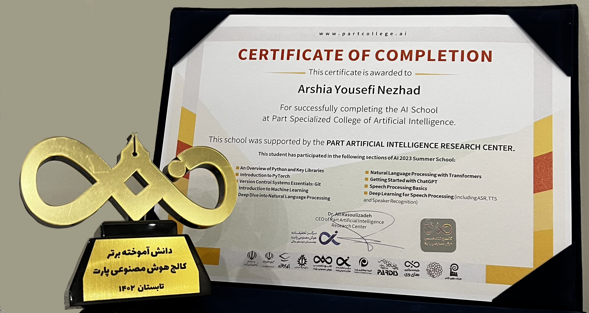

## My Certificates

### [TurboTextSpeech NLP & Speech Processing And AI Summer School](https://partdp.ai/en)
*Issued: Jul 2023 (NLP & Speech Processing) | Jun 2021 (AI Summer School)*  

**NLP & Speech Processing:**  
Engaged with trending concepts in Natural Language Processing and Speech Processing. Gained foundational knowledge in NLP, including n-gram models and Transformer architectures, and learned to apply Hugging Face models. Explored key speech processing techniques and their applications.

**AI Summer School:**  
Became familiar with computer vision, machine learning system design, deep learning with PyTorch, NLP, machine learning on graphs, recommender systems, generative adversarial neural networks (GANs), and advanced topics in deep learning.

---

### [Deep Learning Specialization](https://www.coursera.org/account/accomplishments/certificate/7GET8FSP8ZKM)
**Coursera**  
*Issued: Oct 2020*  
Completed the Deep Learning Specialization by Andrew Ng, covering neural networks, deep learning, convolutional networks, sequence models, and practical applications in computer vision and natural language processing.

---

### [Machine Learning A-Z](https://www.udemy.com/certificate/UC-a2449951-dcdb-4c0b-9b63-7b44628fe33d/)
**Coursera**  
*Issued: Oct 2020*  
Completed the Machine Learning A-Z course, covering data preprocessing, regression, classification, clustering, association rule learning, reinforcement learning, natural language processing, and deep learning using Python and R.

---

### [Deep Learning Interactive Student](https://deeplearning.neuromatch.io/tutorials/intro.html)
**Neuromatch**  
*Issued: Jul 2022*  
Passed the Neuromatch Academy Deep Learning course, gaining hands-on experience with neural networks, backpropagation, optimization, convolutional networks, and advanced deep learning concepts through interactive projects and collaborative learning.

---

### Computer Vision Intern
[**Shenasa**](https://shenasa.ai/)

*Issued: 2022*  
Worked on a face anti-spoofing project, developing and testing computer vision algorithms to detect presentation attacks and improve authentication security in real-world factory environments.

---

### Machine Learning Bootcamp
[**Ranema College**](https://rahnemacollege.com/)

*Issued: Jan 2022*  
Completed an intensive bootcamp focused on practical machine learning concepts, including Reinforcement Learning, Recommender System, MLOps, model evaluation, and hands-on projects using Python.

---
